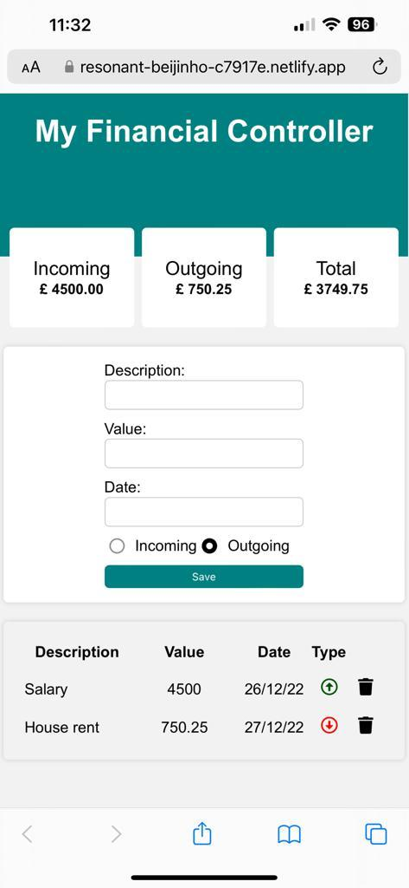

# React in out Finance Controller - [App link](https://resonant-beijinho-c7917e.netlify.app/)

**This is a simple useful control app that allows you to control your incoming and outcoming**

* Packages and dependencies
    - react useState - useEffect
    - react [icons](https://react-icons.github.io/react-icons/)
    - react [input mask](https://www.npmjs.com/package/react-input-mask)
    - react [uuid](https://www.npmjs.com/package/uuid)
    - [sass](https://www.npmjs.com/package/sass)

* All transactions are saved in browser local storage

* Hosted on [Netlify](https://www.netlify.com/)

The main goal of this project is to demonstrate the skills using React Hooks, forms and maping array into HTML component dynamically, also using conditional state to change the style.

* It was build to work with the most mobile phones as well with desktop as shown below

Desktop image  

Mobile phone (iPhone 13 Pro Max)  

Mobile phone (iPhone 13 Pro Max)  
  

transactions = [  
{  
amount: "4500",  
date: "26/12/22",  
description: "Salary",  
expense: false,  
id: "1cd4fe00-59d1-477a-b805-6c4240e9cc25"  
},  
{  
amount: "750.25",  
date: "27/12/22",  
description: "House rent",  
expense: true,  
id: "3fbd1187-9a81-4d3d-976b-051ee10a2fef"  
}  
]
